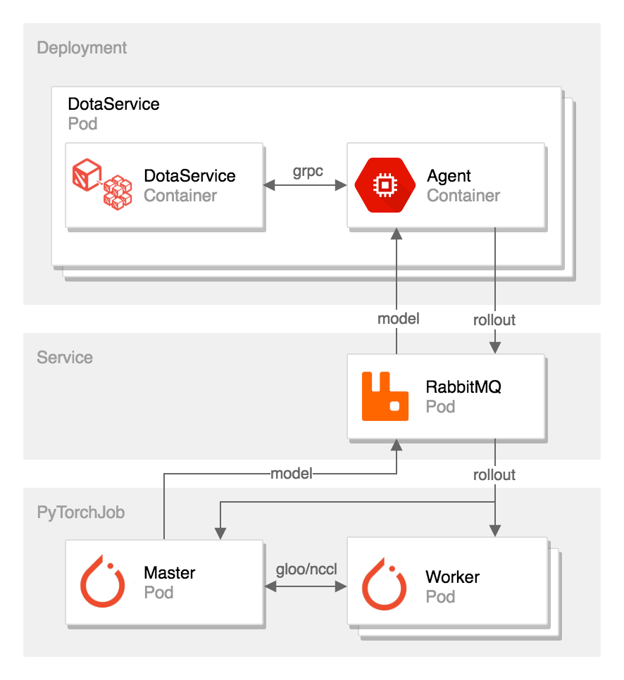

# DotaClient on K8s

---

DotaClient is a reinforcement learning system to train RL agents to play Dota 2 through self-play.

Video: [(Youtube) 1v1 self play, 9 Mar 2019, uses fountain for regen!](https://www.youtube.com/watch?v=hxitG142gsY).
Video: [(Youtube) 1v1 self play, 29 jan 2019](https://www.youtube.com/watch?v=6vgStVonDdA).

This is built upon the [DotaService](https://github.com/TimZaman/DotaService) project, that exposes the game of Dota2 as a (grpc) service for synchronous play.



* Distributed Agents self-playing Dota 2.
* Experience/Model Broker (rmq).
* Distributed Optimizer (PyTorch)

## Prerequisites

* Kubeflow's [PyTorch Operator](https://github.com/kubeflow/pytorch-operator)
* Kubernetes Cluster (e.g. GKE).
* Build the [dota docker image](https://github.com/TimZaman/DotaService)
* Build the [dotaservice docker image](https://github.com/TimZaman/DotaService)
* Build the [rabbitmq docker image](docker/Dockerfile-rmq)
* Install [ksonnet](https://ksonnet.io/)

## Launch distributed dota training

```bash
cd ks-app
ks show default  # Shows the full manifest
ks param list  # Lists all parameters
ks apply default  # Launches everything you need
```

Note: A typical job has 40 agents per optimizer. One optimizer does around 1000 steps/s.
